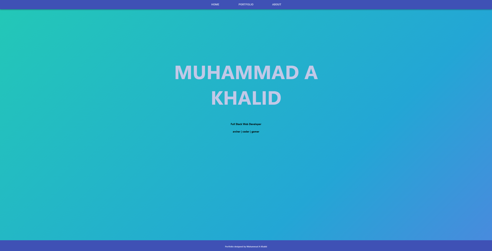
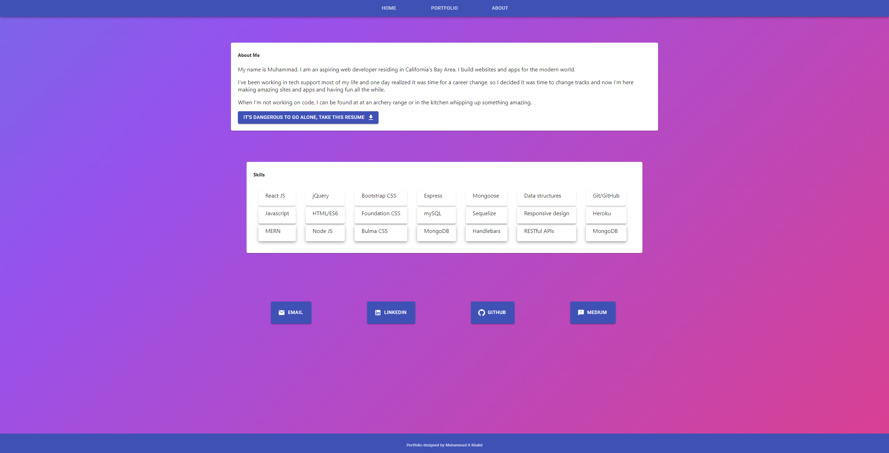
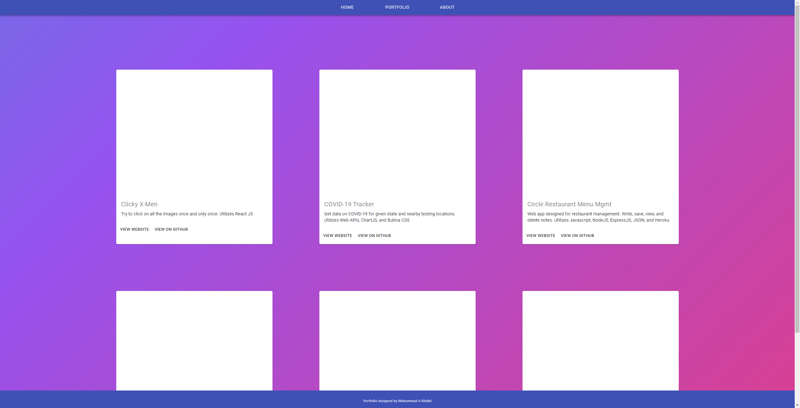

# Reactfolio  [](https://opensource.org/licenses/MIT) 
###### This readme has been procedurally generated 


-----------------------
## Table of Contents
1. [Description](#description)
2. [Deployed link](#deployed-link)
3. [Code snippets](#code-snippets)
4. [Built with](#built-with)
5. [Questions](#questions)

-----------------------
## Description
For this portfolio I really wanted to utilize a new framework and after much deliberation I decided on Material-UI react component. I really like the look of Google's Material Design and though it would look good on my portfolio,




-----------------------
## Deployed link
https://react-folio-03.herokuapp.com/

-----------------------
## Code snippets



To build the project cards displayed on my portfolio page, I used the following material-ui core components

```javascript
import { makeStyles } from '@material-ui/core/styles';
import {
	Button,
	Card,
	CardActions,
	CardContent,
	CardMedia,
	Grid,
	Typography
} from '@material-ui/core';
```

In my portfolio Component, I created a projectState that loads the details of my project.json file so I can make changes to my projects.json file and then React will take care of the rest. 

```javascript
const [projectState, setProjectState] = useState([]);

useEffect(() => {
	setProjectState(projects);
},[])
```

-----------------------
## Built With

- React.JS
- Material-UI

-----------------------
## Questions
Created by Muhammad A Khalid

If you have any questions you can reach me at the following email: [akhalid.code@gmail.com](mailto:akhalid.code@gmail.com)

Follow my other work at GitHub: https://github.com/akhalid88/
